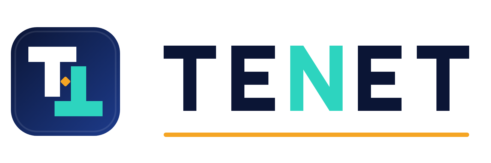
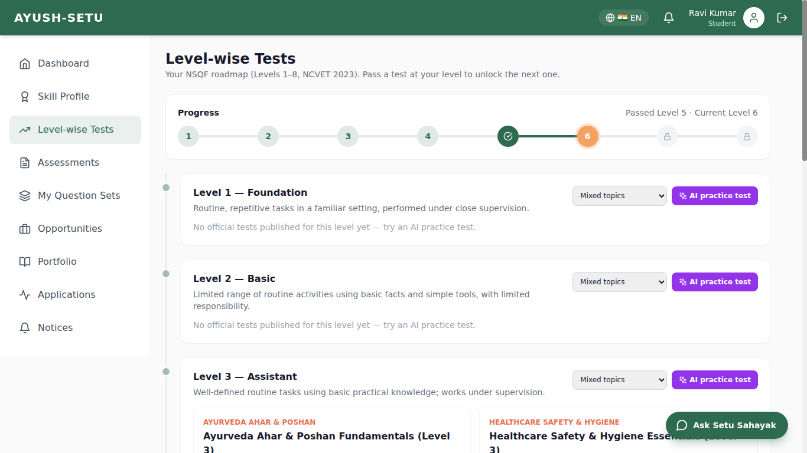
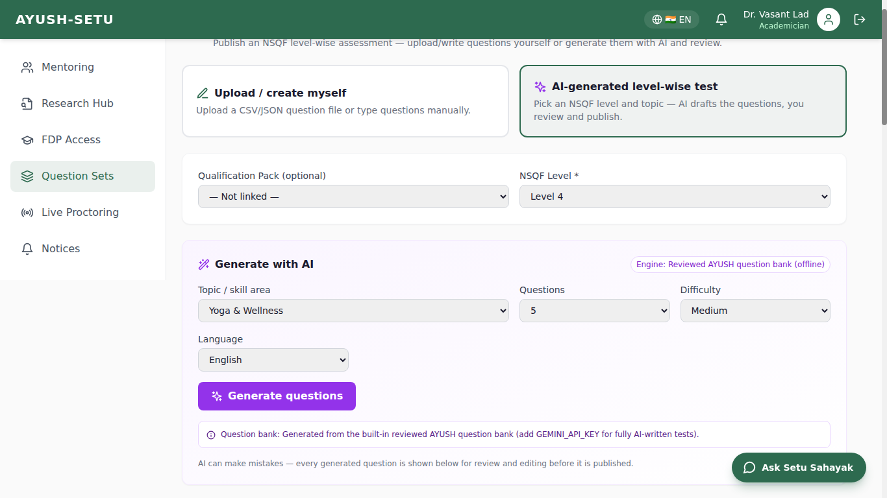
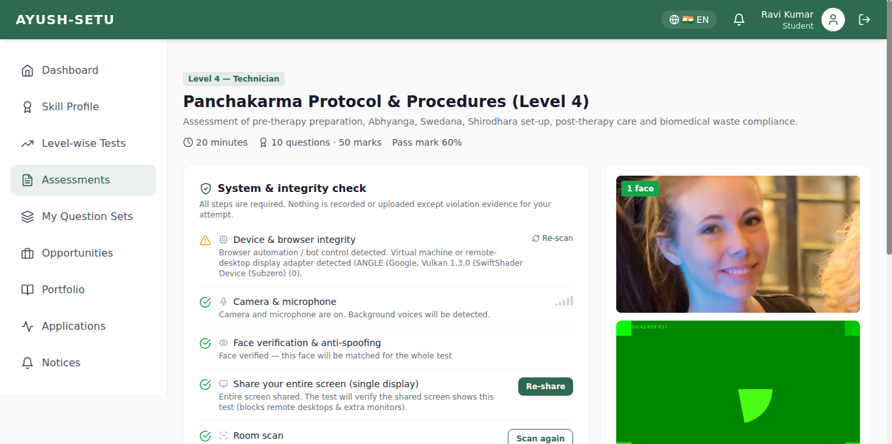
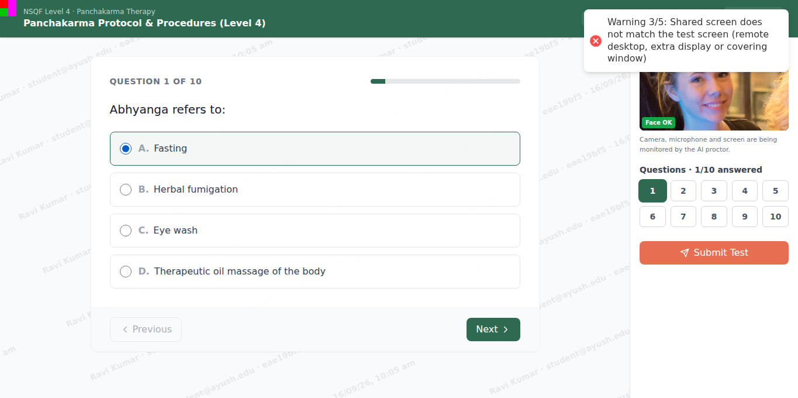
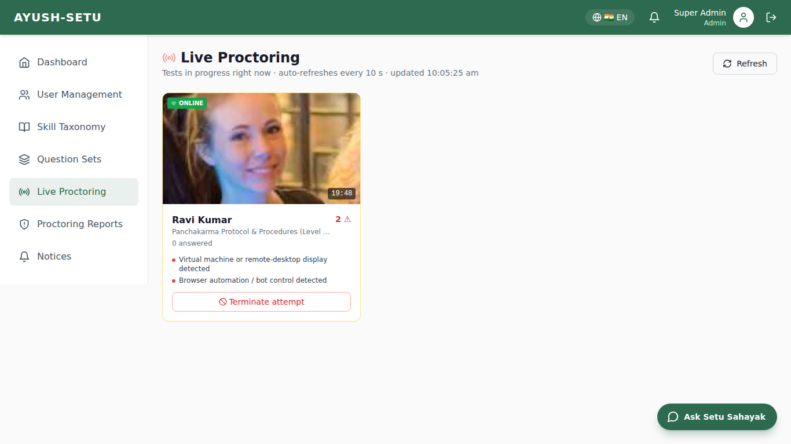
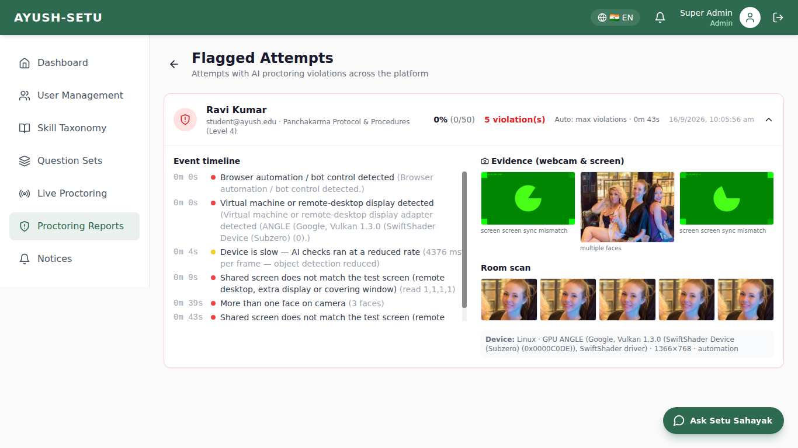
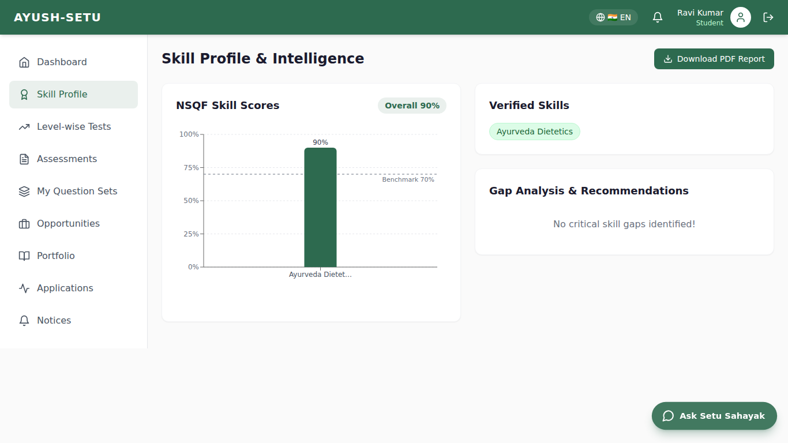
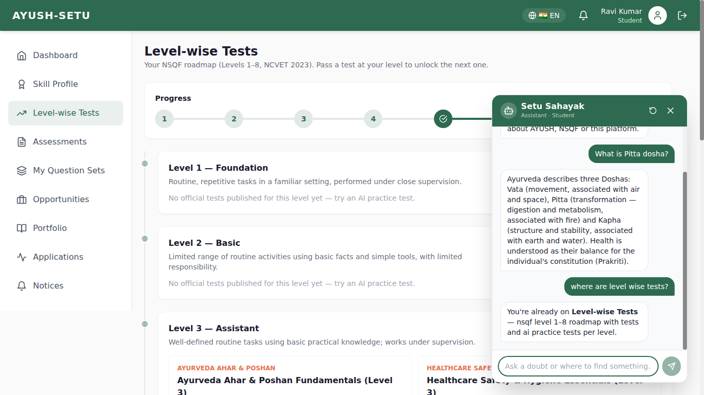

<p align="center">
  
</p>

# AYUSH-SETU 🏛️

**ONE PLATFORM, ONE ECOSYSTEM** — a unified portal connecting AYUSH students, academicians, institutions and industry across skill mapping, NSQF-aligned assessments, internships and placements.

**SIH26044 · Ministry of Ayush · Software · Team Tenet · Smart India Hackathon 2026**

---

## ✨ Highlights

| Area | What it does |
|---|---|
| **NSQF Level-wise Tests** | Levels 1–8 as per the NSQF notified by NCVET (June 2023). Roadmap page, level locking (pass Level N → unlock N+1), per-level AI practice tests |
| **Two ways to create tests** | **Upload/create myself** (CSV, JSON or manual editor) or **AI-generated level-wise test** (Gemini / OpenAI-compatible LLM, or the built-in reviewed AYUSH question bank offline) — always reviewed before publishing |
| **AI Proctoring** | Camera + microphone + entire-screen share, full-screen lock, face detection & recognition, anti-spoofing, extra-person & mobile-phone detection, gaze tracking, voice ↔ lip-sync detection, screen-sync verification, remote-desktop / VM / automation checks, room scan, watermarking, auto-submit after 5 serious violations |
| **Live Proctoring** | Real-time dashboard of tests in progress (webcam frame, violations, answered count) with one-click termination |
| **Attempt integrity** | Server-side attempts with heartbeat autosave, server-authoritative timer, per-student question & option shuffling, resume detection, one live test per student, evidence reports |
| **Setu Sahayak chatbot** | Role-aware navigation ("open level-wise tests") + doubt answering (LLM or offline knowledge base); disabled during tests and logs misuse |
| **Skill intelligence** | Skill score bar chart vs 70% benchmark, gap analysis, PDF report, AI-matched internships/jobs |
| **Notices** | Results, level unlocks, proctoring alerts and broadcasts by admins/institutions |

---

## 📸 Screenshots

| Level-wise Tests (NSQF L1–8) | Create test: upload or AI-generated |
|---|---|
|  |  |
| **System & integrity check** | **Proctored test (full screen, watermark, screen-sync marker)** |
|  |  |
| **Live proctoring** | **Flagged attempt evidence report** |
|  |  |
| **Skill Profile bar graph** | **Setu Sahayak chatbot** |
|  |  |

---

## 🛡️ Anti-cheating coverage

| Cheating method | Detection / prevention |
|---|---|
| Switching tabs, opening other apps, overlay AI apps | `visibilitychange`, window blur + focus polling, questions hidden when focus is lost, screen evidence snapshot |
| Leaving full screen / closing the test | Full-screen lock (keyboard lock on Chromium), blocking overlay, `beforeunload` guard, auto-submit on close, resume flagged |
| Remote access (AnyDesk / TeamViewer / RDP) — "keyboard + screen sync" | Entire-screen share with rotating colour-code **screen-sync marker**, virtual/remote display adapter detection (WebGL renderer), remote-control cursor pattern, script-generated input, **answers entered with no face on camera** |
| Second monitor / projector | `screen.isExtended`, Window Management API display count, display-change events, screen-sync mismatch |
| Another person helping (in view or off-camera) | Multi-face detection, person detection (CenterNet), face recognition against the verified start face, **voice detection with lip-sync** (voice while candidate's lips don't move = someone else speaking) |
| Phone used to photograph questions / look up answers | Mobile phone detection, repeated looking-down detection, traceable watermark (name · email · attempt · time) |
| Photo / video held to the webcam | Anti-spoofing + liveness models |
| Impersonation | Face embedding captured at start and re-verified every few seconds |
| Copy-paste to AI, screenshots, printing, DevTools | Clipboard, context menu, selection, print & shortcut blocking; DevTools detection; extension DOM-injection detection |
| Bots / automation | `navigator.webdriver`, headless UA, synthetic event detection |
| Answer sharing between candidates | Per-attempt question + option shuffling on the server |
| Parallel sittings / second device / asking the in-app AI | One live attempt per student; chatbot disabled and violation logged during a live test |
| Timer tampering / going offline | Server-authoritative expiry, heartbeat autosave, late submissions flagged, abandoned attempts auto-finalised |

> Browsers cannot see other apps or block OS shortcuts completely. The platform therefore **detects, records and blocks progress** (with evidence), and lets live proctors terminate attempts. A dedicated lockdown desktop client is on the roadmap.

---

## 🏗️ Architecture

```
React 18 + Vite + Tailwind (client)          AI in the browser: @vladmandic/human (TF.js)
   │  REST (JWT)                              face · mesh · iris · faceres · antispoof · liveness · CenterNet
   ▼                                          Web Audio voice activity detection · Screen Capture API
Node.js + Express + Prisma (server)  ──►  PostgreSQL + pgvector
   │  optional LLM (Gemini / OpenAI-compatible) for chatbot + AI test generation
   ▼
FastAPI AI engine (matching, gap analysis, embeddings)
```

---

## 🚀 Quick Start

### Prerequisites
- Node.js 18+ (20 recommended), Python 3.11+, PostgreSQL 15+ with the `vector` extension (or `docker compose up postgres`)

### 1. Backend
```bash
cd server
cp .env.example .env          # set DATABASE_URL, JWT_SECRET (+ optional GEMINI_API_KEY)
npm install
npx prisma db push            # or: npx prisma migrate dev
node prisma/seed.js
npm run dev                   # http://localhost:5000  (health: /api/health)
```

### 2. AI Engine
```bash
cd ai-engine
python -m venv venv
venv\Scripts\activate         # Windows  (source venv/bin/activate on macOS/Linux)
pip install -r requirements.txt
uvicorn app.main:app --reload --port 8000
```

### 3. Frontend
```bash
cd client
npm install
npm run dev                   # http://localhost:5173 (proxies /api to :5000)
```

> Camera, microphone and screen sharing only work on `https://` or `http://localhost`.

### Demo credentials
| Role | Email | Password |
|------|-------|----------|
| Student | student@ayush.edu | password123 |
| Industry | industry@ayush.com | password123 |
| Academician | academician@ayush.edu | password123 |
| Institution | institution@ayush.edu | password123 |
| Admin | admin@ayush.gov.in | admin123 |

---

## 🤖 AI configuration (optional)

| Variable | Purpose |
|---|---|
| `GEMINI_API_KEY` | Free key from [Google AI Studio](https://aistudio.google.com/apikey) — AI chatbot answers + AI-written tests |
| `OPENAI_API_KEY` + `OPENAI_BASE_URL` + `OPENAI_MODEL` | Any OpenAI-compatible provider (OpenAI, Groq, OpenRouter, local Ollama) |

Without a key everything still works: the chatbot answers from its built-in knowledge base and AI tests are drawn from the reviewed AYUSH question bank (`server/src/utils/questionBank.js`).

---

## 📄 Question file format

```csv
question,option1,option2,option3,option4,correct,explanation
"How many Rasas are described in Ayurveda?",Three,Five,Six,Eight,C,"Madhura, Amla, Lavana, Katu, Tikta, Kashaya"
```
`correct` accepts A–F, 1–6 or the exact option text. JSON: `[{ "question", "options": [], "correctIndex" }]` or `{ "title", "questions": [...] }`.

---

## 📂 Project structure

```
client/                 React app
  src/proctoring/       vision.js · voice.js · screen.js · integrity.js · useProctoring.js
  src/pages/student/    LevelTests · Assessments · TakeAssessment · SkillProfile …
  src/pages/shared/     UploadQuestionSet · QuestionSets · LiveProctoring · ProctoringReports · Notifications
  public/models/        self-hosted AI models
server/
  src/routes/           assessments · attempts · chatbot · notifications · …
  src/services/         assessmentService (scoring, attempts, finalisation)
  src/utils/            nsqf · llm · questionBank · chatKnowledge
  prisma/               schema, migrations, seed
ai-engine/              FastAPI matching & analytics
docs/brand/             Team Tenet logo (SVG/PNG)
docs/screenshots/       Product screenshots
docs/presentation/      SIH 2026 PPT + PDF
```

## 📚 Seeded NSQF data

Qualification packs (Healthcare Sector Skill Council): **HSS/Q3901** Ayurveda Ahar and Poshan Sahayak (L3), **HSS/Q3601** Panchakarma Technician (L4), **HSS/Q3902** Ayurveda Dietician (L5). Seeded tests cover Levels 3–6.

---

*Built by Team Tenet for Smart India Hackathon 2026*
